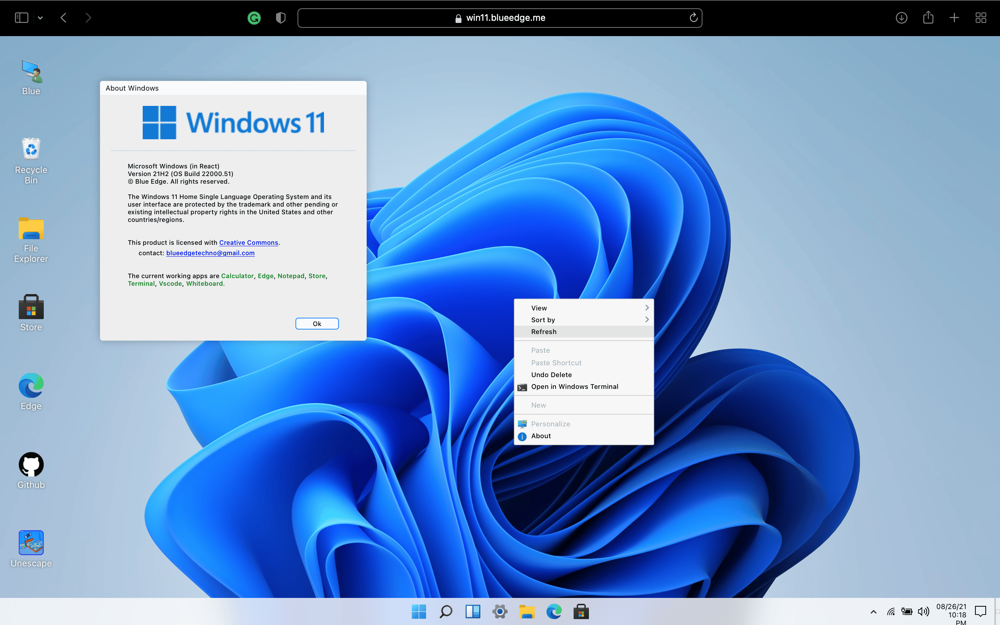

import { Card, Cards } from 'nextra/components'

{<h1 className="mt-10 mb-4 text-center text-[2.5rem] font-bold tracking-tight">Showcase</h1>}

{
Open
source projects using Million.js
}

<Cards>
  <ShowcaseCard title="Wyze" href="https://www.wyze.com/">
    <></>
  </ShowcaseCard>
  <ShowcaseCard title="Dona AI" href="https://dona.ai/">
    <></>
  </ShowcaseCard>
  <ShowcaseCard title="T4 Stack" href="https://app.t4stack.com/">
    <></>
  </ShowcaseCard>
  <ShowcaseCard title="VeganCheck.me" href="https://vegancheck.me/">
    <></>
  </ShowcaseCard>
  <ShowcaseCard title="Windows 11 Web" href="https://win11.vercel.app/">
    <></>
  </ShowcaseCard>
  <ShowcaseCard
    title="Jahir.dev"
    href="https://jahir.dev/"
  >
    <></>
  </ShowcaseCard>
  <ShowcaseCard
    title="LogLib"
    href="https://www.loglib.io/"
  >
    <></>
  </ShowcaseCard>
  <ShowcaseCard title="Comty" href="https://github.com/ragestudio/comty">
    <></>
  </ShowcaseCard>
</Cards>

export const ShowcaseCard = Object.assign(
  // Copy card component and add default props
  Card.bind(),
  {
    displayName: 'ShowcaseCard',
    defaultProps: {
      image: true,
      arrow: true,
      target: '_blank'
    }
  }
)

