import { Card, Cards } from 'nextra/components';

{<h1 className="mt-10 mb-4 text-center text-[2.5rem] font-bold tracking-tight">Showcase</h1>}

{
Projects powered by Million.js.
}

<Cards>
  <ShowcaseCard title="Wyze" href="https://wyze.com/">
    <>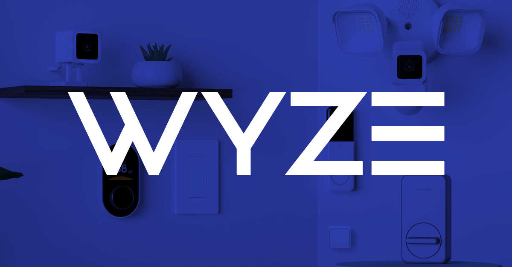</>
  </ShowcaseCard>
  <ShowcaseCard title="Metamask" href="https://metamask.io/">
    <>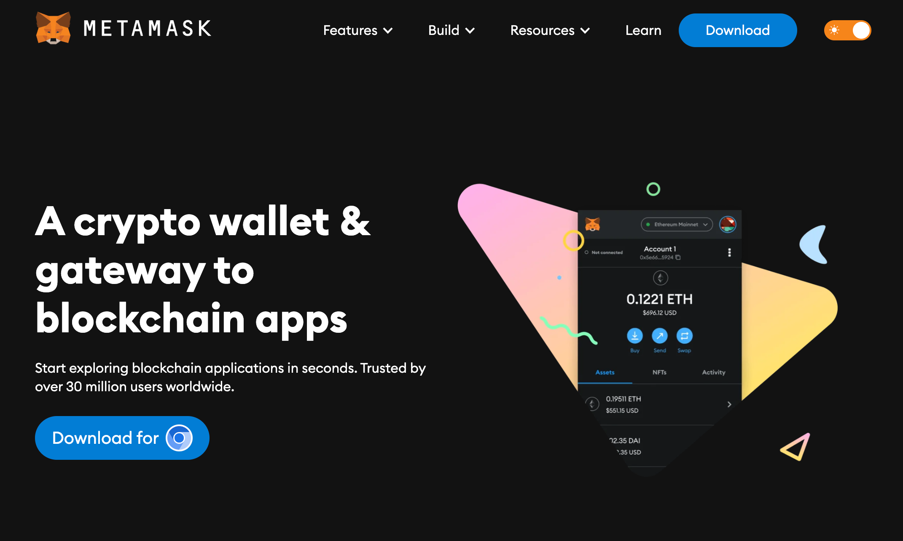</>
  </ShowcaseCard>
  <ShowcaseCard title="Hack Club" href="https://hackclub.com/">
    <>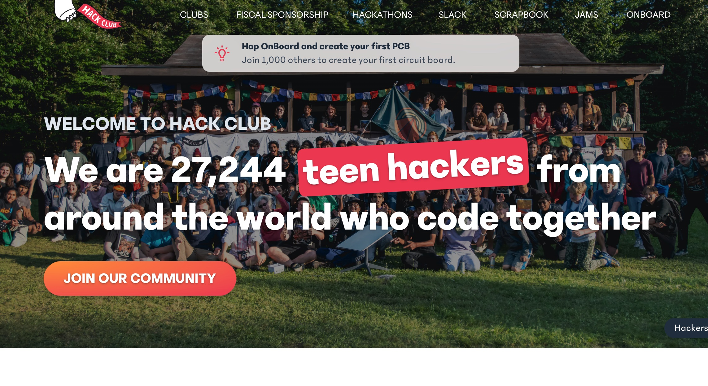</>
  </ShowcaseCard>
  <ShowcaseCard title="Texts" href="https://texts.com/">
    <></>
  </ShowcaseCard>
  <ShowcaseCard title="OpenSauced" href="https://opensauced.pizza/">
    <>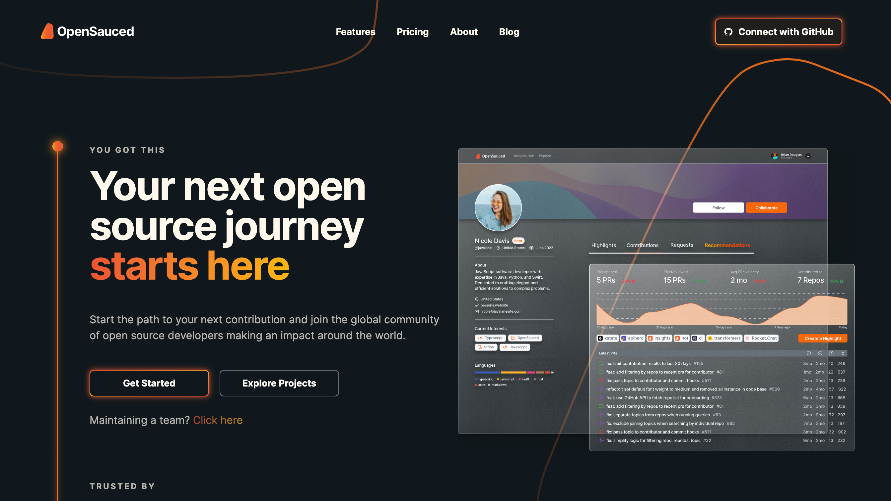</>
  </ShowcaseCard>
  <ShowcaseCard title="Typehero" href="https://typehero.dev/">
    <>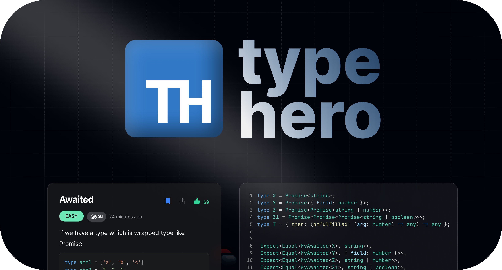</>
  </ShowcaseCard>
  <ShowcaseCard title="LLM Report" href="https://llm.report/">
    <>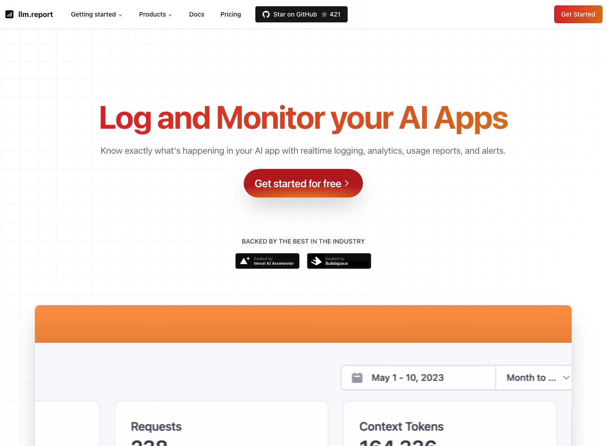</>
  </ShowcaseCard>
  <ShowcaseCard title="Supabox AI" href="https://supaboxai.com/">
    <>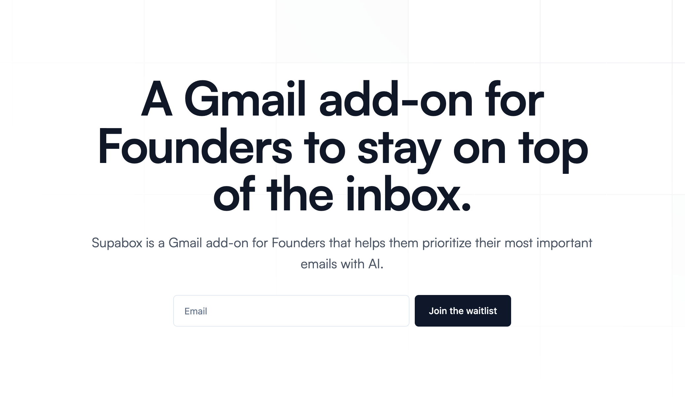</>
  </ShowcaseCard>
  <ShowcaseCard title="Studio Freight" href="https://studiofreight.com/">
    <>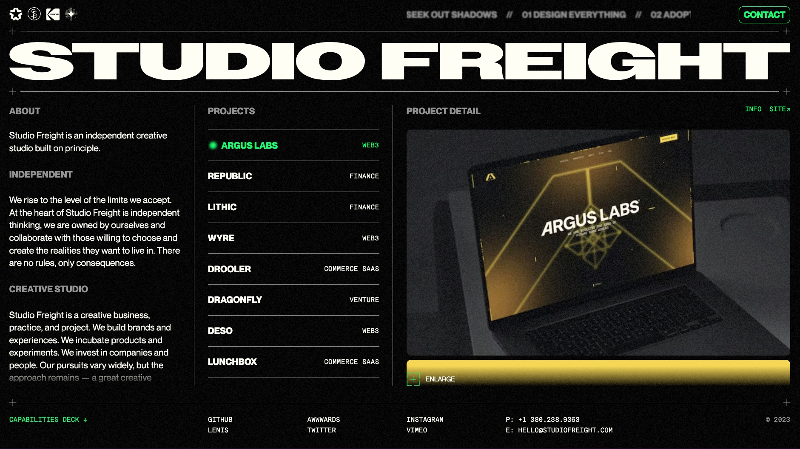</>
  </ShowcaseCard>
  <ShowcaseCard title="Dona AI" href="https://dona.ai/">
    <>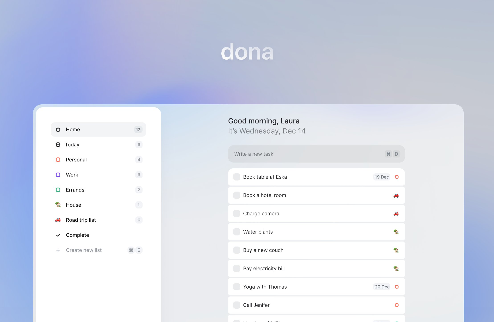</>
  </ShowcaseCard>
  <ShowcaseCard title="T4 Stack" href="https://t4stack.com/">
    <></>
  </ShowcaseCard>
  <ShowcaseCard title="VeganCheck.me" href="https://vegancheck.me/">
    <></>
  </ShowcaseCard>
  <ShowcaseCard
    title="Windows 11 Web"
    href="https://github.com/PiyushSuthar/Windows-11-Web"
  >
    <>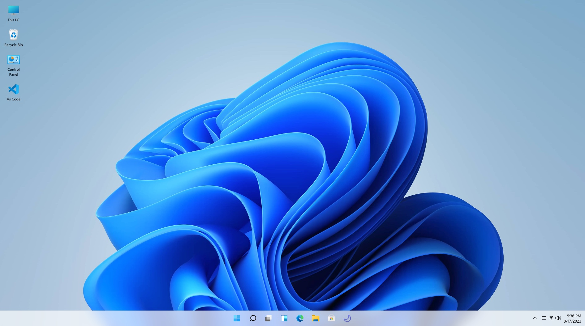</>
  </ShowcaseCard>
  <ShowcaseCard
    title="jahir.dev"
    href="https://github.com/jahirfiquitiva/jahir.dev"
  >
    <>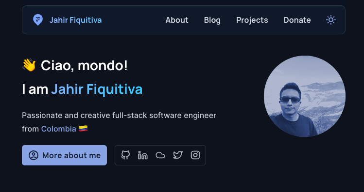</>
  </ShowcaseCard>
  <ShowcaseCard title="LogLib" href="https://www.loglib.io/">
    <>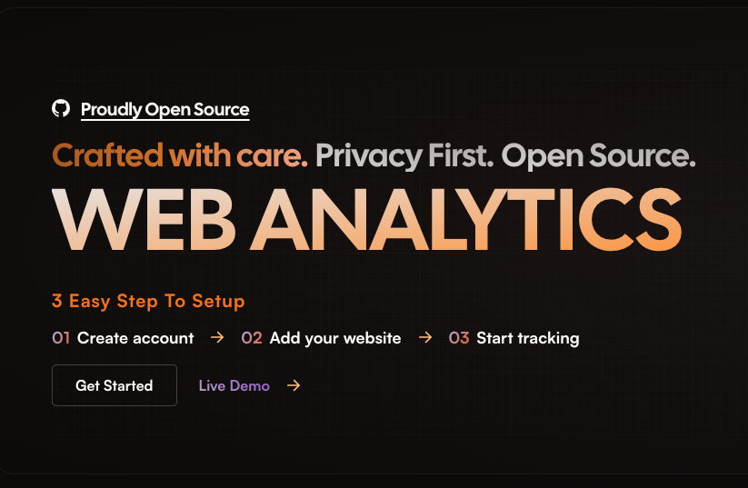</>
  </ShowcaseCard>
  <ShowcaseCard title="Comty" href="https://github.com/ragestudio/comty">
    <></>
  </ShowcaseCard>
    <ShowcaseCard title="4c" href="https://github.com/FrancescoXX/4c-site">
    <>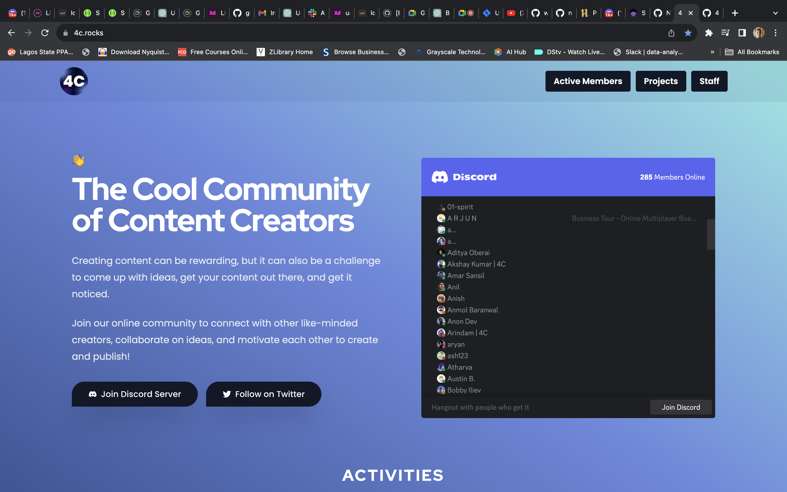</>
  </ShowcaseCard>
</Cards>

export const ShowcaseCard = Object.assign(
  // Copy card component and add default props
  Card.bind(),
  {
    displayName: 'ShowcaseCard',
    defaultProps: {
      image: true,
      arrow: true,
      target: '_blank',
    },
  },
);

